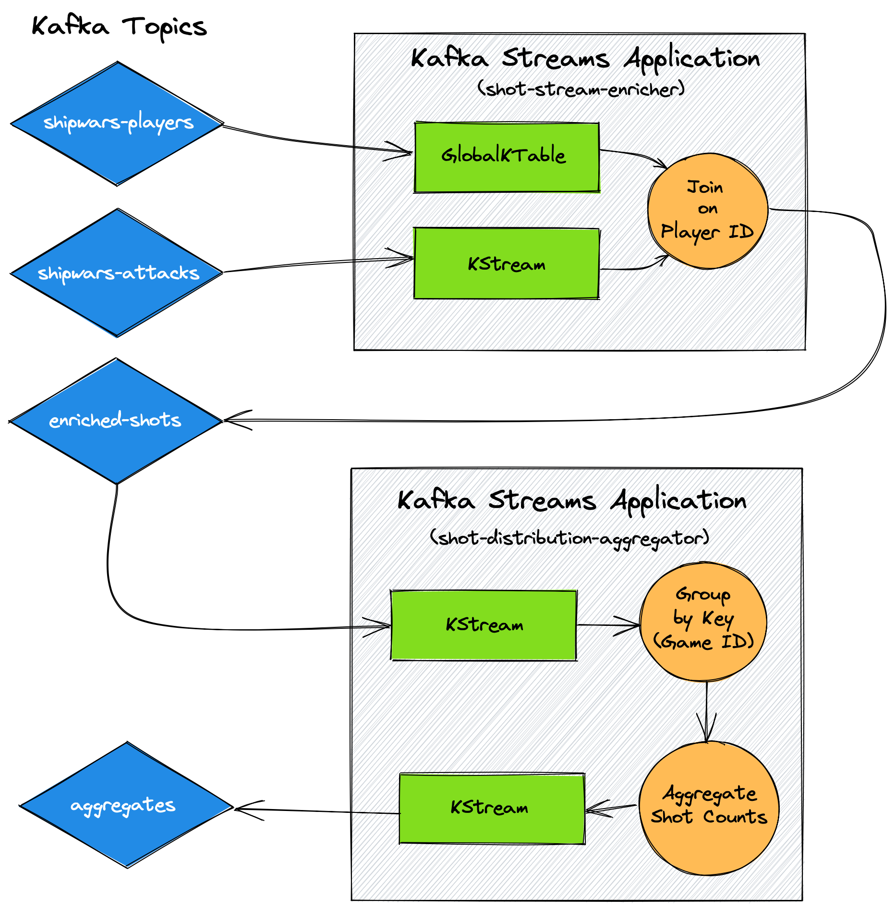

# Shipwars Streams

Java application that uses [Quarkus](https://quarkus.io/) and [Apache Kafka Streams](https://kafka.apache.org/documentation/streams)
to analyse events sent to Kafka by the [Shipwars Game Server](https://github.com/redhat-gamedev/shipwars-game-server).

## Streams Topologies

* _shot-stream-enricher_ - Joins shot event data with the associated player data. This enriched topic is used by the _shot-distribution-aggregator_.
* _shot-distribution-aggregator_ - Aggregates the distribution of shots for given game generations (each game server deployment is a new generation).

<div align="center">
	<br>
    
	<br>
  <i>Architecture of this Quarkus Kafka Streams Application.</i>
  <br>
  <br>
</div>

The _shot-distribution-aggregator_ exposes the following endpoints:

* `GET /shot-distribution` - Returns the shot distribution for all game generations in JSON format.
* `GET /shot-distribution/stream` - Opens a HTTP Server-Sent Events stream that sends each enriched shot to the HTTP client.

The shot distribution JSON response contains top-level game generation keys,
and within these are the hit/miss counts for each cell and each player type.

```js
{
  "a-unique-game-uuid": {
    "0,0": {
      "ai_hit": 6,
      "ai_miss": 2,
      "human_hit": 3,
      "human_miss": 5
    },
     "0,1": {
      "ai_hit": 1,
      "ai_miss": 6,
      "human_hit": 2,
      "human_miss": 5
    }
    // Data for every cell on the 5x5 grid, i.e up to key "4,4"...
  },
  "another-unique-game-uuid": { /* Data for all cells in that game */ }
}
```

## Use with OpenShift Streams for Apache Kafka

Each module is configured to use SASL SSL to connect to Kafka, since this is
standard with OpenShift Streams for Apache Kafka.

```bash
# Get the bootstrap URL using the rhoas CLI. A client ID and secret can be
# obtained using the rhoas CLI or cloud.redhat.com UI
KAFKA_BOOTSTRAP_SERVERS=$(rhoas kafka describe | jq .bootstrapServerHost -r) \
KAFKA_CLIENT_ID="replace-me" \
KAFKA_CLIENT_SECRET="replace-me" \
./mvnw quarkus:dev -f shot-distribution-aggregator/pom.xml
```

## Running Locally

Refer to the Docker/Podman guides in [Shipwars Deployment](https://github.com/redhat-gamedev/shipwars-deployment).
For example to run Shipwars services using Docker:

```bash
KAFKACONNECTION_BOOTSTRAPSERVERS=$(rhoas kafka describe | jq .bootstrapServerHost -r) \
KAFKACONNECTION_SSL=true \
KAFKACONNECTION_USER="replace-me" \
KAFKACONNECTION_PASSWORD="replace-me" \
docker-compose up --force-recreate --build
```

Next, start each Kafka Streams module by targeting the necessary `pom.xml`:

```bash
# Get the bootstrap URL using the rhoas CLI. A client ID and secret can be
# obtained using the rhoas CLI or cloud.redhat.com UI
KAFKA_BOOTSTRAP_SERVERS=$(rhoas kafka describe | jq .bootstrapServerHost -r) \
KAFKA_CLIENT_ID="replace-me" \
KAFKA_CLIENT_SECRET="replace-me" \
./mvnw quarkus:dev -f shot-distribution-aggregator/pom.xml
```

*Note: The _shot-distribution-aggregator_ relies on the _shot-stream-enricher_ for data, so you need to run both.*

## Building

### JAR files

This will build both application module JARs.

```bash
mvn clean install
```

### Docker Images

Each module contains a script folder. Run the `build.sh` script from the root
of the module you'd like to build:

```bash
# These will use defaults if not provided
IMAGE_TAG=latest \
IMAGE_REPOSITORY=quay.io/yourusername/name-of-image \
./scripts/build.sh
```

To push the image use the `push.sh`:

```bash
# These will use defaults if not provided
IMAGE_TAG=latest \
IMAGE_REPOSITORY=quay.io/yourusername/name-of-image \
./scripts/push.sh
```

## Running for Development

Follow the guide above to run the associated services using Docker/Podman, but
remove this service from the Dockerfile, i.e start all of the services using
`docker-compose up` except this one.

Once the other services have started, you can start this one using:

```bash
QUARKUS_KAFKA_STREAMS_BOOTSTRAP_SERVERS=localhost:9094 \
KAFKA_BOOTSTRAP_SERVERS=localhost:9094 \
QUARKUS_HTTP_PORT=8585 \
./mvnw quarkus:dev -f shot-distribution-aggregator/pom.xml
```

## Scaling

Kafka Streams pipelines can be scaled out, i.e. the load can be distributed
amongst multiple application instances running the same pipeline.

This particular example has not been designed to support this functionality.
